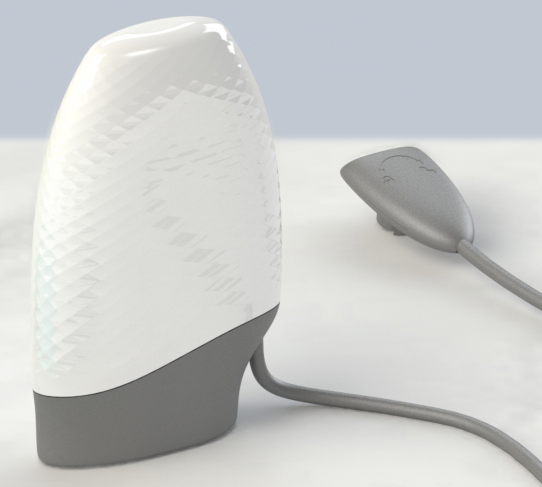
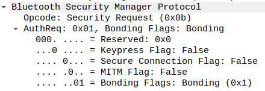

_This repository is not affiliated with Powerpal.  This code builds on previous work from WeekendWarrior1 and muneeb1990_

# powerpal_ble
Collection of code, tools and documentation for data retrieval over BLE from your Powerpal.

☕ If this integration's useful to you, [buy me a coffee](https://ko-fi.com/gurrier).

[*Home Assistant Community Discussion*](https://community.home-assistant.io/t/powerpal-smart-energy-monitor/263713/126)



- [Using the ESPHome Component](#using-the-esphome-component)
- [Useful Extras](#useful-extras)
- [Connection Reliability and Diagnostics](#connection-reliability-and-diagnostics)
- [BLE Documentation](#ble-documentation)
- [Powerpal API Key and Device ID](#powerpal-api-key-and-device-id)

## Using the ESPHome Component

The ESPHome component hasn't been merged into esphome yet, but you can use it via `external_components`

#### Requirements:
- An ESP32
- A configured Powerpal
- Powerpal device information:
  - BLE MAC address (can be found on device sticker, by ESPHome BLEtracker, or by using an app like nRF Connect once you have disabled the bluetooth of all your smart devices)
  - Connection pairing pin (6 digits you input when setting up your device, also can be found printed in Powerpal info pack, or inside the Powerpal application)
  - Your Smart meter pulse rate (eg. 1000 pulses = 1kW/h)

```yaml
external_components:
  - source:
      type: git
      url: https://github.com/gurrier/esphome-powerpal_ble.git
      ref: "main" # or a specific version tag, e.g. "1.6.3", to pin to a stable release
    components: [ powerpal_ble ]

# optional requirement used with daily energy sensor
time:
  - platform: homeassistant
    id: homeassistant_time

ble_client:
  - mac_address: DF:5C:55:00:00:00
    id: powerpal

sensor:
  - platform: powerpal_ble
    ble_client_id: powerpal
    power:
      name: "Powerpal Power"
    daily_energy:
      name: "Powerpal Daily Energy"
    energy:
      name: "Powerpal Total Energy"
    battery_level:
      name: "Powerpal Battery"
    pairing_code: 123123
    notification_interval: 1 # get updates every 1 minute
    pulses_per_kwh: 1000
    time_id: homeassistant_time # daily energy still works without a time_id, but recommended to include one to properly handle daylight savings, etc.
#    cost_per_kwh: 0.20 #dollars per kWh, flat-rate only
#    powerpal_device_id: 0000abcd #optional, component will retrieve from your Powerpal if not set
#    powerpal_apikey: 4a89e298-b17b-43e7-a0c1-fcd1412e98ef #optional, component will retrieve from your Powerpal if not set
```
> **`main` vs. a version tag:** `ref: "main"` tracks the latest commit, which means the ESPHome Dashboard will flag an "Update available" in Home Assistant whenever new code lands — but that code hasn't necessarily been validated against real hardware yet. Pinning to a version tag (e.g. `"1.6.3"`) is the recommended default: your build only changes when you deliberately bump the tag after reading the release notes. Track `main` only if you specifically want to follow development closely and accept the occasional rough edge.

You can also find a full config here: [powerpalproesp.yaml](powerpalproesp.yaml)

And the component code here: [powerpal_ble ESPHome Component](components/powerpal_ble)

## Useful Extras

A few small YAML additions people have found handy:

**Retrieve your API key / device ID without digging through logs** — the component already reads these from your Powerpal on connect; a button + lambda lets you surface them as text sensors instead of hunting through log output:

```yaml
text_sensor:
  - platform: template
    name: "Powerpal API Key"
    id: powerpal_api_key
  - platform: template
    name: "Powerpal Device ID"
    id: powerpal_device_id

button:
  - platform: template
    name: "Retrieve Powerpal API Key and Device ID"
    on_press:
      then:
        - lambda: |-
            id(powerpal_api_key).publish_state(id(powerpal_ble_sensor).get_apikey());
            id(powerpal_device_id).publish_state(id(powerpal_ble_sensor).get_device_id());
```

**Manually force an RTC resync** — the Powerpal's onboard clock is generally reliable, but it does drift or reset for some people (e.g. after a battery replacement — see reports on [Whirlpool](https://forums.whirlpool.net.au/archive/3m01ljx6) and [ProductReview](https://www.productreview.com.au/listings/powerpal-energy-monitor/q-and-a)). This uses ESPHome's built-in `ble_client.ble_write` action directly against the Powerpal's `time` characteristic — no component code involved at all:

```yaml
button:
  - platform: template
    name: "Powerpal: Set Device Time (now)"
    on_press:
      - ble_client.ble_write:
          id: powerpal
          service_uuid: '59DAABCD-12F4-25A6-7D4F-55961DCE4205'
          characteristic_uuid: '59DA0004-12F4-25A6-7D4F-55961DCE4205'   # time
          value: !lambda |-
            uint32_t t = id(homeassistant_time).now().timestamp;
            return std::vector<uint8_t>{
              (uint8_t)(t      ), (uint8_t)(t >> 8),
              (uint8_t)(t >> 16), (uint8_t)(t >> 24)
            };
```

**Automatically keep the RTC in sync** — rather than remembering to press a button, this script waits for both Home Assistant's time and the BLE connection to be ready, syncs the clock, and retries every 2 minutes if either isn't ready yet. Wire it to run once on boot and periodically thereafter:

```yaml
esphome:
  on_boot:
    priority: -100
    then:
      - script.execute: sync_powerpal_time

script:
  - id: sync_powerpal_time
    mode: restart
    then:
      # Wait for Home Assistant time (max 30s)
      - wait_until:
          condition:
            lambda: 'return id(homeassistant_time).now().is_valid();'
          timeout: 30s

      # Wait for BLE connection (max 30s)
      - wait_until:
          condition:
            lambda: 'return id(powerpal).connected();'
          timeout: 30s

      # Only sync if both are ready
      - if:
          condition:
            lambda: |-
              return id(homeassistant_time).now().is_valid() &&
                     id(powerpal).connected();
          then:
            - logger.log: "Syncing Powerpal RTC time"
            - ble_client.ble_write:
                id: powerpal
                service_uuid: '59DAABCD-12F4-25A6-7D4F-55961DCE4205'
                characteristic_uuid: '59DA0004-12F4-25A6-7D4F-55961DCE4205'
                value: !lambda |-
                  uint32_t t = id(homeassistant_time).now().timestamp;
                  return std::vector<uint8_t>{
                    (uint8_t)(t), (uint8_t)(t >> 8),
                    (uint8_t)(t >> 16), (uint8_t)(t >> 24)
                  };
          else:
            - logger.log: "Skipping RTC sync (timeout or not connected)"
            - delay: 2min
            - script.execute: sync_powerpal_time

interval:
  - interval: 6h
    then:
      - script.execute: sync_powerpal_time
```

Credit to [SleepinDevil's fork](https://github.com/SleepinDevil/esphome-powerpal_ble) for this pattern.

**Use encryption instead of a password for API/OTA** — ESPHome has deprecated plaintext password auth in favor of encryption keys (the password option is removed entirely as of ESPHome 2026.1.0). One API encryption key can protect both API and OTA traffic — OTA just reuses it:

```yaml
api:
  encryption:
    key: !secret esphome_api_encryption_key

ota:
  - platform: esphome
    encryption: # reuses the api encryption key above; no password needed
```

Unlike a password, encryption also keeps the firmware image itself confidential in transit, not just gate-kept.

**See which version of the component is installed** — add a `version` text sensor and it appears as a diagnostic entity on the device page in Home Assistant. The component also prints its version in the boot log. Builds taken from a branch such as `main` include the git commit, e.g. `1.6.3 (647e50b)`, so unreleased builds are distinguishable:

```yaml
sensor:
  - platform: powerpal_ble
    # ...
    version:
      name: "Powerpal BLE Version"
```

To also see which ESPHome version (and build time) produced the firmware, add ESPHome's built-in `version` text sensor. It needs nothing from this component. `hide_hash: true` drops the config hash from the value to keep it short. If you already have a `text_sensor:` section, add it to that list:

```yaml
text_sensor:
  - platform: version
    name: "ESPHome Version"
    hide_hash: true
```

**Improve BLE reliability against WiFi power-saving** — the ESP32 shares its WiFi and Bluetooth radio, and WiFi's default power-saving behavior is a known source of BLE timing issues. If you're seeing frequent disconnects, try disabling it:

```yaml
wifi:
  power_save_mode: none
```

## Connection Reliability and Diagnostics

If your readings sometimes stop for a while, or flatline until the ESP32 is restarted, work through this section in order. Everything here is optional, and added in 1.8.

**Check the signal strength first.** The most common cause of dropouts is a Bluetooth link that's too weak. The ESP32 is simply too far from the Powerpal, or there's metal (such as a meter box) between them. These three sensors show it:

```yaml
sensor:
  - platform: powerpal_ble
    # ...
    link_rssi:
      name: "Powerpal Link RSSI"
    advertisement_rssi:
      name: "Powerpal Advertisement RSSI"
    advertisement_rate:
      name: "Powerpal Advertisement Rate"
```

- **Link RSSI** is the strength of the connection, read every minute. Aim for better than about **−75 dBm**. Around −85 or worse, expect regular dropouts; around −95 the ESP32 can barely hear the Powerpal at all. It shows unknown while there's no connection.
- **Advertisement RSSI** and **Advertisement Rate** only report while the link is down, because the Powerpal stops advertising while it's connected. So `0 ads/min` with an unknown advertisement RSSI is normal. A non-zero rate means the link was down during that minute, which makes the rate a good drop counter.

In one real setup, moving the ESP32 to the room beside the meter box took the link from about −90 to about −70 dBm, and the frequent dropouts stopped. If you can, put the ESP32 near the Powerpal, at a similar height, with the antenna end of the board pointing toward it and away from metal. Then watch Link RSSI as you adjust it. Disabling WiFi power-saving (see [Useful Extras](#useful-extras)) also helps.

**Reconnect by hand without restarting the ESP32.** ESPHome's own `ble_client` switch drops and re-establishes just the Powerpal link. It's useful for testing whether a stuck connection recovers with a simple reconnect. It always comes back on after a restart:

```yaml
switch:
  - platform: ble_client
    ble_client_id: powerpal
    name: "Powerpal BLE Connection"
```

**Optional self-healing watchdog.** Set `stale_restart_after` and the ESP32 restarts itself if no reading arrives for that long. Before restarting, it saves the energy counters, so no counted energy is lost. It also records what state the connection was in, and reports that on the next boot:

```yaml
sensor:
  - platform: powerpal_ble
    # ...
    stale_restart_after: 15min
    watchdog_restart_count:
      name: "Powerpal Watchdog Restart Count"
    watchdog_last_reason:
      name: "Powerpal Watchdog Last Reason"
    last_stall:
      name: "Powerpal Last Stall"
```

- **10–15 minutes** is a sensible value. Readings arrive every minute, and short gaps often recover on their own; a very short value like 2–3 minutes mostly restarts the ESP32 for gaps that would have fixed themselves.
- It's a safety net, not a fix. If it fires regularly, go back to Link RSSI.
- The watchdog is off unless `stale_restart_after` is set. The 90-second check below runs inside it, so **Watchdog Last Reason** and **Last Stall** only fill in while it's on.

**What the diagnostics say.** About 90 seconds into a stall, the watchdog checks the connection. **Watchdog Last Reason** shows what it found, after a restart. **Last Stall** shows the same for a stall that recovered without one, prefixed with how long the gap was. Both are kept across restarts. Common results:

| Text | Meaning |
|---|---|
| `connected, notifications on, but the Powerpal stopped sending` | Still on the same connection and subscribed; the Powerpal went quiet |
| `reconnected, notifications on, no reading yet` | The link dropped and came straight back, and was waiting for the Powerpal's next once-a-minute reading. A gap of about 2 minutes like this is normal after a brief drop |
| `connected, but our notifications were off (subscription lost)` | The Powerpal dropped the subscription |
| `reported connected, but no reply to a subscription check (link likely dead)` | The ESP32 still thought it was connected, but nothing was answering |
| `not connected: client …; Powerpal ads …; dropped (0x08)` | The link was down. Shows what the Bluetooth client was doing, whether the Powerpal could still be heard, any failed connection attempts, and why the link dropped |
| `… RSSI -88 dBm` | Signal strength at the time. Weak values point back to placement |

Disconnect reason codes: `0x08` signal lost (supervision timeout), `0x13` the Powerpal ended the connection, `0x16` the ESP32 ended it, `0x3e` the connection couldn't be established, `0x100` a connection attempt was cancelled. A failed connect with status `133` is a generic error, typical of an attempt made on a weak signal.

**Get notified when the watchdog restarts the ESP32.** Add ESPHome's `debug` component with its reset reason sensor:

```yaml
debug:

text_sensor:
  - platform: debug
    reset_reason:
      name: "Reset Reason"
```

Then trigger a Home Assistant automation on that sensor changing to `Reboot request from powerpal_ble.sensor`. Only a watchdog restart produces that exact text, so OTA updates, power cuts and Home Assistant's own restarts won't notify.

The wait step matters. After a restart the ESP32 sends all its values at once, and without the wait the automation can read the reason before Home Assistant has caught up, so the message says "unavailable". Adjust the entity IDs and notify action to suit:

```yaml
triggers:
  - trigger: state
    entity_id: sensor.powerpal_gateway_reset_reason
    to: "Reboot request from powerpal_ble.sensor"
actions:
  - wait_template: >-
      {{ states('sensor.powerpal_gateway_powerpal_watchdog_last_reason')
         not in ['unknown', 'unavailable'] }}
    timeout: "00:01:00"
  - action: notify.mobile_app_your_phone
    data:
      message: >-
        Powerpal gateway restarted itself: {{
        states('sensor.powerpal_gateway_powerpal_watchdog_last_reason') }}
```

## Powerpal API Key and Device ID
The Powerpal Cloud API Key is stored on the Powerpal device itself at `59DA0009-12F4-25A6-7D4F-55961DCE4205`.
The Device ID is stored at `59DA0010-12F4-25A6-7D4F-55961DCE4205`.
The [ESPHome Component](#using-the-esphome-component) prints both after establishing a BLE connection to the Powerpal, or see [Useful Extras](#useful-extras) for a button that shows them in Home Assistant.

Also see [how to decode both values](#retrieving-and-decoding-cloud-api-key-and-device-id)

## BLE Documentation

#### Important BLE services
```js
SERVICE_POWERPAL_UUID: '59DAABCD-12F4-25A6-7D4F-55961DCE4205'
    Characteristics:
        // Once subscribed to notifications, sends pulses with a timestamp every ${readingBatchSize}
        measurement: '59DA0001-12F4-25A6-7D4F-55961DCE4205' // notify, read, write

        // Use to trigger notifications of historic measurements between 2 dates
        measurementAccess: '59DA0002-12F4-25A6-7D4F-55961DCE4205' // indicate, write

        // Once subscribed to notifications, sends a notification (timestamp)for every pulse. This seems to be used by the application to display instantaneous power usage. This will likely chew through battery
        pulse: '59DA0003-12F4-25A6-7D4F-55961DCE4205' // notify, read

        // Used to set the time of the Powerpal. The Powerpal seems to have a pretty good RTC and you will likely not have to set this after the powerpal has been configured in it's app
        time: '59DA0004-12F4-25A6-7D4F-55961DCE4205' // indicate, notify, read, write

        // Seems to retrieve the timestamp of the first and last datapoints stored in the Powerpal
        firstRec: '59DA0005-12F4-25A6-7D4F-55961DCE4205' // read, write

        // Used to configure the sensitivity of the pulse reading sensor (Can also be done within the app)
        ledSensitivity: '59DA0008-12F4-25A6-7D4F-55961DCE4205' // indicate, notify, read, write

        // Read or change Powerpal API key - this stores the Authorization key required to communicate with Powerpal's cloud REST APIs
        uuid: '59DA0009-12F4-25A6-7D4F-55961DCE4205' // indicate, notify, read, write

        // Read or change Powerpal Serial Number (this is also the device ID used in Powerpal's cloud REST APIs)
        serialNumber: '59DA0010-12F4-25A6-7D4F-55961DCE4205' // indicate, notify, read, write

        // needs to be written to with your powerpal pairing key before other services are accessible
        pairingCode: '59DA0011-12F4-25A6-7D4F-55961DCE4205' // indicate, notify, read, write

        // Seems to be used to calculate instantaneous power usage in app
        millisSinceLastPulse: '59DA0012-12F4-25A6-7D4F-55961DCE4205' // read

        // Can be written to to change Powerpal ${measurement} notification interval
        readingBatchSize: '59DA0013-12F4-25A6-7D4F-55961DCE4205' // indicate, notify, read, write
```
#### Connecting to a Powerpal over BLE

The Powerpal has simple authentication requirements allowing most devices and libraries to connect and pair without issue:



After connecting, to be able to read, write or subscribe to notifications of any of the Powerpal Service characteristics your pairingCode must be written to the `pairingCode` characteristic, `59DA0011-12F4-25A6-7D4F-55961DCE4205`.
Your pairingCode needs to be converted to hex and then have its bytes reversed, eg:
```c++
uint32_t powerpal_pass_key = 123123;
// in hex 01E0F3, so
uint32_t powerpal_pass_key_hex = 0x01E0F3;
// esp32 arduino BLE library needs to write data as an array of uint8_t's, so
uint8_t powerpal_pass_key_array[] = {0x00, 0x01, 0xE0, 0xF3};
// Powerpal wants this array in reversed byte order (little endian), so:
uint8_t powerpal_pass_key_array_reversed[] = {0xF3, 0xE0, 0x01, 0x00};

// now this can be written to the pairing code characteristic:
pRemoteCharacteristic_pairingcode->writeValue(powerpal_pass_key_array_reversed, sizeof(powerpal_pass_key_array_reversed), false);
```

Authentication is now complete, so time to configure the `readingBatchSize` (which also needs to be converted to hex and then have its bytes reversed):
```c++
// set update interval to every 1 minute
uint8_t newBatchReadingSize[] = {0x01, 0x00, 0x00, 0x00};
pRemoteCharacteristic_readingbatchsize->writeValue(newBatchReadingSize, sizeof(newBatchReadingSize), false);
```
> :warning: **If reducing the readingBatchSize**:
>
> If you have reduced the readingBatchSize, eg from 15m to 1m, at the time of the next update you will receive all the historic pulse updates that have been collected during the previous interval configuration. 
>This may be an issue if you are writing this data to Home Assistant, which currently doesn't support recieving historic datapoints. 
Luckily all the updates include a timestamp, so you can likely filter to only accept updates that are within +-5 seconds of the current time.

Subscribe to `measurement` notifications:
```c++
pRemoteCharacteristic_measurement->registerForNotify(powerpalCommandCallback);
```

Parse incoming `measurement` notifications:
```c++
// incoming data
// pData = [112 7 98 98 4 0 208 101 196 189 209 1 7 63 123 158 108 62 160 115]
// first 4 bytes (0-3) are a unix time stamp, again with reversed byte order (little endian)
uint32_t unix_time = pData[0];
unix_time += (pData[1] << 8);
unix_time += (pData[2] << 16);
unix_time += (pData[3] << 24);

// next 2 bytes (4+5) are the pulses within the time interval window, with reversed byte order (little endian)
uint16_t total_pulses = pData[4];
total_pulses += pData[5] << 8;
```
#### Retrieving and Decoding Cloud API Key and Device ID

Read and decode API Key:
```c++
// incoming data
// data = [0x95, 0x21, 0x0D, 0x4E, 0x89, 0x4F, 0x42, 0xB7, 0xB8, 0x82, 0x4B, 0x94, 0xDF, 0x7D, 0xAA, 0x34]
// 16 bytes in big endian order that simply need to be converted into a UUID string (lowercase and hyphens at index 8,12,16,20)
const uint8_t length = 16;
const char* hexmap[] = {"0", "1", "2", "3", "4", "5", "6", "7", "8", "9", "a", "b", "c", "d", "e", "f"};
std::string api_key;
for (int i = 0; i < length; i++) {
  if ( i == 4 || i == 6 || i == 8 || i == 10 ) {
    api_key.append("-");
  }
  api_key.append(hexmap[(data[i] & 0xF0) >> 4]);
  api_key.append(hexmap[data[i] & 0x0F]);
}
//  api_key == "95210d4e-894f-42b7-b882-4b94df7daa34";
```

Read and decode Device ID:
```c++
// incoming data
// data = [0xA7, 0x2B, 0x00, 0x00]
// 4 bytes in reversed byte order (little endian) that needs to be converted to a lowercase string
const uint8_t length = 4;
const char* hexmap[] = {"0", "1", "2", "3", "4", "5", "6", "7", "8", "9", "a", "b", "c", "d", "e", "f"};
std::string device_id;
for (int i = length-1; i >= 0; i--) {
  device_id.append(hexmap[(data[i] & 0xF0) >> 4]);
  device_id.append(hexmap[data[i] & 0x0F]);
}
//  device_id == "00002ba7";
```

Test the decoded results on a computer with curl installed:
```
curl -H "Authorization: <YOUR_API_KEY>" https://readings.powerpal.net/api/v1/device/<YOUR_DEVICE_ID>
```
